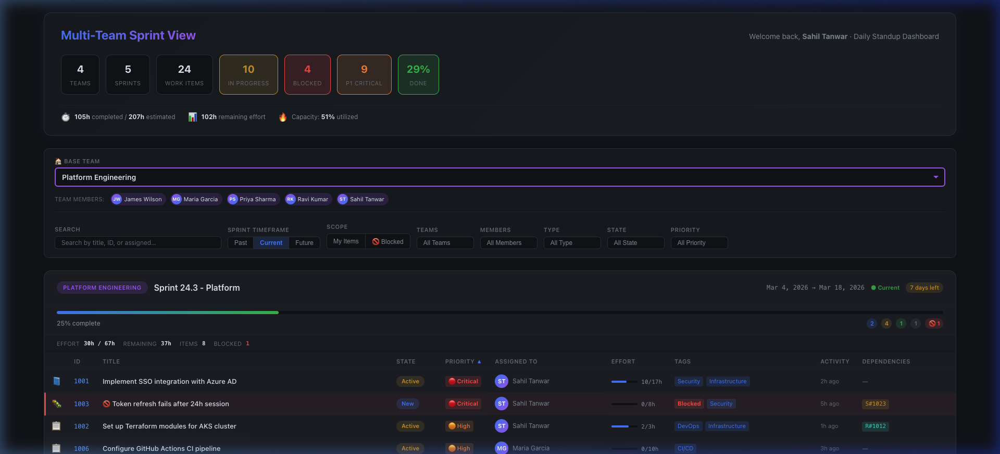
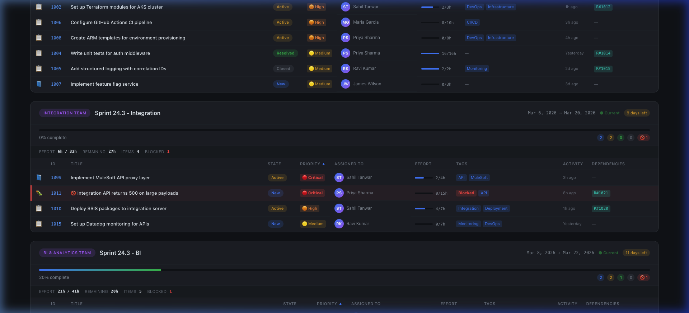

# 🚀 Multi-Team Sprint View — Azure DevOps Extension

A professional Azure DevOps extension designed for **platform/DevOps teams** who serve multiple teams (Integration, BI, SRE, etc.). It provides a unified, cross-team sprint dashboard — ideal for **daily standups** — showing all sprints your team members are involved in, with rich work item details, filters, and metrics.

> **Example:** User X works in the **Platform Engineering** team but serves Integration, BI, and SRE teams. Selecting "Platform Engineering" as the **Base Team** automatically identifies all platform members and shows their work items across every sprint — giving a single-pane-of-glass view for standup.

---

## 📸 Screenshots

### Dashboard with Base Team Selected


### Cross-Team Sprint Cards


---

## ✨ Features

### Summary Metrics Bar
- **Team count**, **Sprint count**, **Work Items**, **In Progress**, **Blocked**, **P1 Critical**, **Done %**
- **Standup metrics**: Completed effort hours, remaining effort, capacity utilization %

### 🏠 Base Team Selector (Key Feature)
Select your **home team** (e.g., Platform Engineering) — the extension automatically:
1. Identifies all members who have work items in that team's sprints
2. Shows their avatar chips (e.g., 👤 User X, 👤 User Y, 👤 User Z)
3. Filters all other teams' sprints to show **only your team members' work items**

This is the core feature for platform teams — you see everywhere your people work.

### Comprehensive Filters
| Filter | Description |
|--------|-------------|
| 🏠 **Base Team** | Select home team — auto-detects and filters by team members |
| 🔍 **Text Search** | Search across title, ID, assigned person, and tags |
| ⏱️ **Sprint Timeframe** | Toggle Past / Current / Future sprints |
| 👤 **My Items** | Show only your assigned items |
| 🚫 **Blocked** | Show only blocked work items |
| 🏢 **Teams** | Multi-select team filter |
| 👥 **Members** | Multi-select team member filter |
| 📋 **Type** | Filter by PBI, Task, Bug, User Story |
| 🏷️ **State** | Filter by New, Active, Resolved, Closed |
| ⚡ **Priority** | Filter by P1 Critical, P2 High, P3 Medium, P4 Low |

### Sprint Cards
- **Team badge** with sprint name and date range
- **Progress bar** with completion percentage
- **Standup strip**: Effort hrs, remaining hrs, item count, blocked count
- **State summary**: Colored badges showing New/Active/Resolved/Closed counts

### Work Item Table (10 Columns)
| Column | Description |
|--------|-------------|
| Type | Emoji icon (📘 PBI, 📋 Task, 🐛 Bug, 📖 Story) |
| ID | Clickable link to work item |
| Title | With 🚫 blocked indicator |
| State | Color-coded badge (blue/amber/green/grey) |
| Priority | 🔴 Critical / 🟠 High / 🟡 Medium / 🟢 Low |
| Assigned To | Avatar with initials + name |
| Effort | Progress bar with hours (completed/total) |
| Tags | Colored tag badges, blocked tags highlighted red |
| Activity | Relative time (e.g., "2h ago", "Yesterday") |
| Dependencies | Predecessor / Successor / Related links |

### Sortable Columns
Click any column header (Type, ID, Title, State, Priority, Assigned, Effort) to sort ascending/descending with a visual ▲▼ indicator.

### Blocked Item Highlighting
- Red left border on blocked rows
- 🚫 icon in the title
- Pulsing red badge in the summary bar

---

## 📁 Project Structure

```
multi-team-project-ext/
├── src/
│   ├── components/
│   │   ├── dashboard.ts         # Main orchestrator
│   │   ├── filters.ts           # Filter bar + apply logic
│   │   ├── helpers.ts           # Utilities (priority, state, dates)
│   │   ├── summaryBar.ts        # Top metrics bar
│   │   ├── teamSprintCard.ts    # Sprint card with sortable table
│   │   └── workItemRow.ts       # Single work item row
│   ├── services/
│   │   ├── dataService.ts       # Azure DevOps REST API calls
│   │   └── mockData.ts          # Mock data for local dev
│   ├── styles/
│   │   └── main.css             # Dark theme CSS (design tokens)
│   ├── multi-team-sprint.ts     # Production entry point (SDK)
│   └── local-dev.ts             # Local dev entry point (mock data)
├── static/
│   ├── multi-team-sprint.html   # Production HTML shell
│   └── index.html               # Local dev HTML shell
├── images/
│   └── icon.png                 # Extension icon (128×128)
├── docs/
│   └── *.png                    # Screenshots for documentation
├── vss-extension.json           # Extension manifest
├── webpack.config.js            # Build config (prod + local dev)
├── tsconfig.json                # TypeScript config
├── package.json                 # Dependencies and scripts
├── overview.md                  # Marketplace description
└── .gitignore
```

---

## 🛠️ Prerequisites

- [Node.js](https://nodejs.org/) (v16+)
- [npm](https://www.npmjs.com/) (v8+)
- [TFX CLI](https://www.npmjs.com/package/tfx-cli) — for packaging (`npm install -g tfx-cli`)
- [GitHub CLI](https://cli.github.com/) — for repo creation (`brew install gh`)

---

## 🏃 Local Development (with Mock Data)

You can run and preview the full dashboard locally using mock data — **no Azure DevOps connection needed**.

### 1. Install Dependencies

```bash
cd multi-team-project-ext
npm install
```

### 2. Start Local Dev Server

```bash
npm run dev:local
```

This starts a Webpack dev server at **http://localhost:3000** with:
- Hot module replacement (HMR)
- Mock data for 4 teams (Platform, Integration, BI, SRE)
- 30 realistic work items with priorities, tags, blocked states
- **Platform Engineering** pre-selected as the base team

### 3. View in Browser

Open **http://localhost:3000/index.html** in your browser.

> **Tip:** The local dev mode uses `HtmlWebpackPlugin` to auto-inject the `local-dev.js` bundle. Any code changes will automatically hot-reload.

### How Local Dev Works

| Component | Production | Local Dev |
|-----------|-----------|-----------|
| Entry point | `src/multi-team-sprint.ts` | `src/local-dev.ts` |
| Data source | Azure DevOps REST API | `src/services/mockData.ts` |
| HTML | `static/multi-team-sprint.html` | `static/index.html` |
| Bundle | `multi-team-sprint.js` | `local-dev.js` |
| Env var | — | `LOCAL_DEV=true` |

---

## 📦 Build for Production

```bash
npm run build
```

This generates the production bundle in `dist/`:
- `dist/multi-team-sprint.html`
- `dist/multi-team-sprint.js`
- `dist/images/icon.png`

---

## 🚀 Package as VSIX Extension

### 1. Install TFX CLI

```bash
npm install -g tfx-cli
```

### 2. Build the Production Bundle

```bash
npm run build
```

### 3. Create VSIX Package

```bash
tfx extension create --manifest-globs vss-extension.json --output-path ./
```

This creates a `.vsix` file (e.g., `YourPublisher.multi-team-sprint-view-1.0.0.vsix`).

---

## 📤 Publish to Azure DevOps Marketplace

### 1. Create a Publisher

Go to [Visual Studio Marketplace Publishing Portal](https://marketplace.visualstudio.com/manage) and create a publisher if you don't have one.

### 2. Update the Manifest

Edit `vss-extension.json` and replace `"publisher": "YourPublisher"` with your actual publisher ID.

### 3. Publish

```bash
tfx extension publish --manifest-globs vss-extension.json --token <YOUR_PAT>
```

> **Note:** Generate a Personal Access Token (PAT) from Azure DevOps with **Marketplace (Publish)** scope.

### 4. Install in Azure DevOps

1. Go to **Organization Settings → Extensions → Browse Marketplace**
2. Search for your extension or use the **Shared Extensions** tab
3. Click **Install** and select your organization
4. Navigate to your project → **Boards** → **Multi-Team Sprint View**

---

## 🔧 Configuration

### Extension Manifest (`vss-extension.json`)

| Field | Value | Notes |
|-------|-------|-------|
| `id` | `multi-team-sprint-view` | Unique extension ID |
| `publisher` | `YourPublisher` | ⚠️ Replace before publishing |
| `version` | `1.0.0` | Semver format |
| `scopes` | `vso.work` | Read access to work items |

### Azure DevOps Permissions Required

| Scope | Usage |
|-------|-------|
| `vso.work` | Read teams, iterations, work items |

The extension requests **read-only** access to work items and project data. No write permissions needed.

---

## 🧪 Testing

### Local Testing (Recommended for UI)
```bash
npm run dev:local
# Open http://localhost:3000/index.html
```

### Testing in Azure DevOps (Staging)
1. Package as VSIX: `tfx extension create --manifest-globs vss-extension.json`
2. Upload to marketplace as **private** extension
3. Share with your test organization
4. Install and verify under **Boards → Multi-Team Sprint View**

---

## 📝 API Integration Details

The extension uses these Azure DevOps REST APIs:

| API | Purpose |
|-----|---------|
| `CoreRestClient.getTeams()` | Fetch all teams in the project |
| `WorkRestClient.getTeamIterations()` | Get sprints for each team |
| `WorkRestClient.getIterationWorkItems()` | Get work item refs in a sprint |
| `WorkItemTrackingRestClient.getWorkItems()` | Batch fetch work item details |

### Fields Fetched

```
System.Id, System.Title, System.State, System.WorkItemType,
System.AssignedTo, System.Tags, System.ChangedDate,
Microsoft.VSTS.Common.Priority,
Microsoft.VSTS.Scheduling.RemainingWork,
Microsoft.VSTS.Scheduling.OriginalEstimate,
Microsoft.VSTS.Scheduling.CompletedWork,
Microsoft.VSTS.CMMI.BlockedReason
```

---

## 🤝 Contributing

1. Fork the repository
2. Create a feature branch: `git checkout -b feature/my-feature`
3. Commit your changes: `git commit -m 'Add my feature'`
4. Push to the branch: `git push origin feature/my-feature`
5. Open a Pull Request

---

## 📄 License

MIT License — see [LICENSE](LICENSE) for details.

---

## 🙏 Acknowledgments

- [Azure DevOps Extension SDK](https://github.com/microsoft/azure-devops-extension-sdk)
- [Azure DevOps Extension API](https://github.com/microsoft/azure-devops-extension-api)
- Built with TypeScript, Webpack, and a custom dark-theme design system
